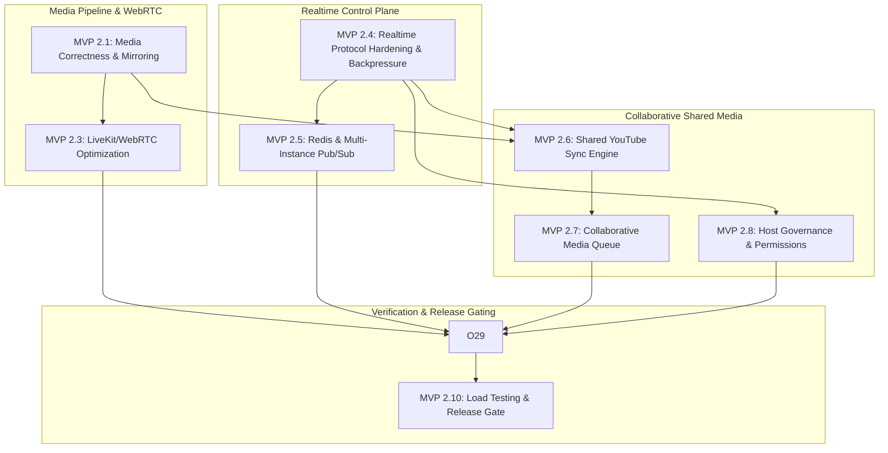

# Mingly Engineering Roadmap — MVP 2 Execution Plan

This document outlines the sequential, dependency-ordered implementation roadmap for **Mingly MVP 2**. Each sub-phase delivers a verifiable layer of functionality with concrete acceptance criteria and explicit dependency gates.

---

## Roadmap Dependency Graph

---

## Phase Breakdown

### MVP 2.1 — Media Correctness & Mirroring
- **Goals:** Establish deterministic camera device lifecycles, eliminate orientation confusion, and maintain stable LiveKit video tracks.
- **Key Deliverables:**
  - Front-camera preview mirroring via CSS/Canvas (`transform: scaleX(-1)` for local self-preview).
  - Unmirrored published video track (remote peers observe natural orientation; text on shirts is readable).
  - Screen-share tracks strictly exempted from mirroring.
  - Facing mode detection (`facingMode: "user"` vs `"environment"`).
  - Resilient device switching without tearing down active WebRTC peer connections.
- **Dependencies:** None (builds directly on MVP 1 LiveKit setup).
- **Gate Criteria:** Self-preview appears mirrored on front camera; remote peer observes unmirrored video; screen share is never flipped.

---

### MVP 2.3 — LiveKit / WebRTC Media Optimization
- **Goals:** Maximize video call quality and bandwidth efficiency across heterogeneous network conditions.
- **Key Deliverables:**
  - Adaptive streaming: clients subscribe only to video resolutions matching their rendered DOM element size.
  - Dynacast & Simulcast: SFU pauses track forwarding for off-screen or hidden participants.
  - Dynamic subscription quality: compact tile thumbnails receive low-bitrate streams; solo/stage receives high-bitrate streams.
  - Screen-share optimization: set `contentHint: "detail"`, high framerate text sharpness, prioritized bandwidth.
  - Connection quality indicators displaying packet loss and jitter states.
- **Dependencies:** Requires **MVP 2.1** (stable media track lifecycle).
- **Gate Criteria:** Minimizing a participant tile drops received bitrate by $>60\%$; screen share maintains legible small text at 1080p.

---

### MVP 2.4 — Realtime Protocol Hardening & Backpressure
- **Goals:** Eliminate head-of-line blocking, enforce strict backpressure, and harden client reconnect recovery.
- **Key Deliverables:**
  - Bounded outbound channel buffers (`outboundCapacity = 64`) per connection.
  - Non-blocking broadcast loop with slow consumer isolation (`conn.CloseNow()` on saturated buffers).
  - Standardized JSON Envelope (`type`, `version`, `event_id`, `room_id`, `payload`).
  - Finite state machine for reconnect: `DISCONNECTED` → `CONNECTING` → `CONNECTED` → `RECONNECTING` → `RESYNCING` → `FAILED`.
  - Authoritative `room.snapshot` state replacement upon reconnect (zero event replay buffers).
  - Heartbeat ping/pong with client-side NTP-style clock offset calibration.
- **Dependencies:** Builds on MVP 1 Go WebSocket hub.
- **Gate Criteria:** Saturated mock client dropped in $<50\text{ms}$; fast peers experience zero broadcast latency penalty; reconnecting client recovers state in $<1\text{s}$.

---

### MVP 2.5 — Redis & Multi-Instance Realtime
- **Goals:** Allow Mingly backend instances to scale horizontally behind a load balancer without room fragmentation.
- **Key Deliverables:**
  - Redis Pub/Sub room bus (`room:<id>:events`) relaying events across Go instances.
  - Loop prevention using unique `origin_instance_id` in inter-node payloads.
  - Ephemeral presence tracking in Redis using key TTLs (15s) refreshed by client heartbeats.
  - Distributed rate limiting counters for join, chat, and media actions.
  - Graceful fallback to single-node in-memory operation if `REDIS_URL` is empty or Redis drops.
- **Dependencies:** Requires **MVP 2.4** (typed protocol and bounded channels).
- **Gate Criteria:** Client A on Instance 1 and Client B on Instance 2 in the same room exchange chat and media state seamlessly; Redis restart drops presence temporarily without data corruption.

---

### MVP 2.6 — Shared YouTube Synchronization Engine
- **Goals:** Deliver rock-solid, synchronized YouTube video playback across all room members with zero backend media streaming.
- **Key Deliverables:**
  - Server-authoritative `MediaState`: anchor position and timestamp calculation ($P = P_0 + (t - t_0) \times \text{rate}$).
  - Client YouTube IFrame API integration with gesture activation.
  - Zero periodic position broadcasting (state updates broadcast only on play/pause/seek/advance).
  - Three-tier client drift correction:
    - Tier 1 ($<250\text{ms}$): Inaudible natural drift, no adjustment.
    - Tier 2 ($250\text{ms}–1500\text{ms}$): Gentle playback rate nudge ($0.95\times$ / $1.05\times$).
    - Tier 3 ($>1500\text{ms}$): Hard seek resync.
  - Canonical automatic progression at video conclusion based on server duration timer.
- **Dependencies:** Requires **MVP 2.1** (stable room session) and **MVP 2.4** (clock offset calibration).
- **Gate Criteria:** 4 concurrent clients stay synchronized within $\pm 250\text{ms}$; pausing host immediately pauses all clients within $100\text{ms}$.

---

### MVP 2.7 — Collaborative Media Queue
- **Goals:** Enable room members to curate, reorder, and advance a shared playback queue safely.
- **Key Deliverables:**
  - Stable UUID track identities (never index-based references).
  - Queue operations: `queue.add`, `queue.remove`, `queue.reorder`, `queue.select`, `queue.next`, `queue.clear`, `queue.shuffle`.
  - Optimistic concurrency control via `expected_version` checking; stale mutations cleanly rejected (`errMediaStale`).
  - Input validation: strict YouTube URL parsing, title/channel length sanitization, max 50 items.
- **Dependencies:** Requires **MVP 2.6** (shared YouTube engine).
- **Gate Criteria:** Rapid concurrent queue additions resolve deterministically without track duplication or index corruption.

---

### MVP 2.8 — Host Governance & Permissions
- **Goals:** Protect rooms from griefing with server-evaluated permissions and host authority.
- **Key Deliverables:**
  - Centralized domain authorization functions: `CanChangeSettings`, `CanKick`, `CanControlMedia`, `CanManageQueue`.
  - Room lock toggle (`room.lock`): prevents new guest entries while active.
  - Participant eviction (`participant.kick`): immediately closes the WebSocket, persists a room ban, and asks LiveKit to remove the active participant. LiveKit Cloud token revocation is supported; self-hosted LiveKit may keep an already issued JWT valid until expiry.
  - Host disconnect grace period (15s timer before room state eviction or host reassignment).
- **Dependencies:** Requires **MVP 2.4** (protocol envelopes and client eviction).
- **Gate Criteria:** Non-host clients attempting privileged operations receive `403 / MEDIA_COMMAND_REJECTED`; kicked participant cannot rejoin locked room.

---

### MVP 2.9 — Observability & Failure Resilience
- **Goals:** Instrument the entire distributed system with structured telemetry and verify graceful degradation across all failure modes.
- **Key Deliverables:**
  - Structured JSON logging (`log/slog`) with correlation context (`request_id`, `room_id`, `participant_id`, `connection_id`, `instance_id`).
  - Zero logging of credentials, tokens, or personal identifiers.
  - Low-cardinality Prometheus domain metrics (connection counts, latency histograms, queue drops, Redis errors).
  - Automated failure test suite: PostgreSQL disconnect, Redis crash, LiveKit downtime, client network drops, camera revocation.
- **Dependencies:** Requires **MVP 2.3**, **MVP 2.5**, **MVP 2.7**, **MVP 2.8**.
- **Gate Criteria:** Complete failure mode runbook verified; all error logs carry structured IDs; metrics collector does not leak high-cardinality labels.

---

### MVP 2.10 — Load Testing & Release Gate
- **Goals:** Validate concurrency, memory boundaries, and broadcast latency under synthetic multi-user stress before production deployment.
- **Key Deliverables:**
  - k6 / Go load testing harness executing 10, 25, 50, and 100 concurrent room connection scenarios.
  - Join/leave burst tests, chat burst fan-out, slow consumer injection, and reconnect storm validation.
  - Memory and goroutine leak profiling with `pprof`.
  - Release gate signoff: zero data races (`go test -race ./...`), $P_{95}$ broadcast latency $<50\text{ms}$, zero memory leaks.
- **Dependencies:** Requires **MVP 2.9** (observability instrumentation).
- **Gate Criteria:** All load test profiles pass within specified latency and resource envelopes.
